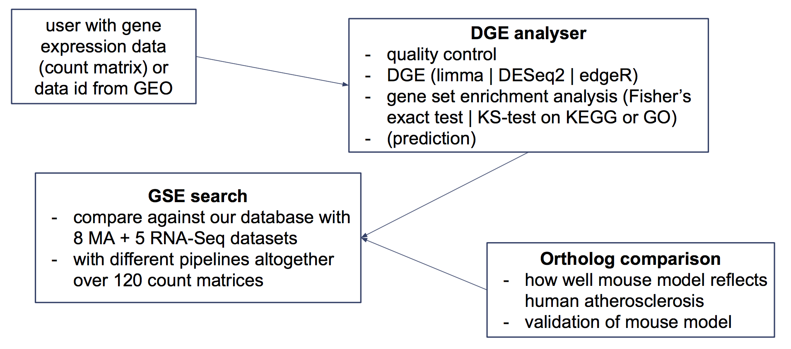
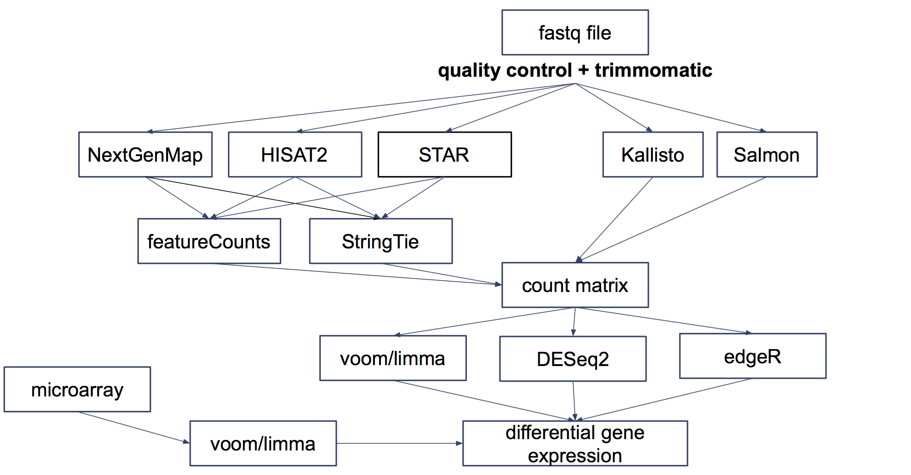
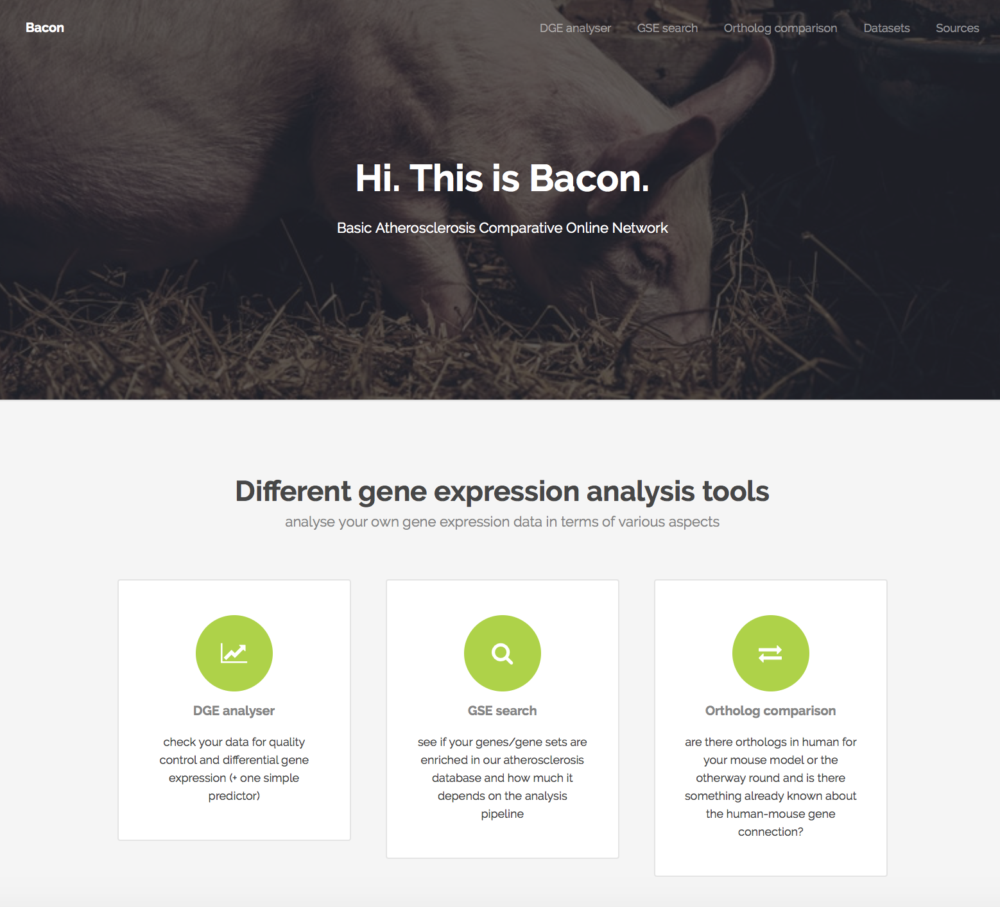
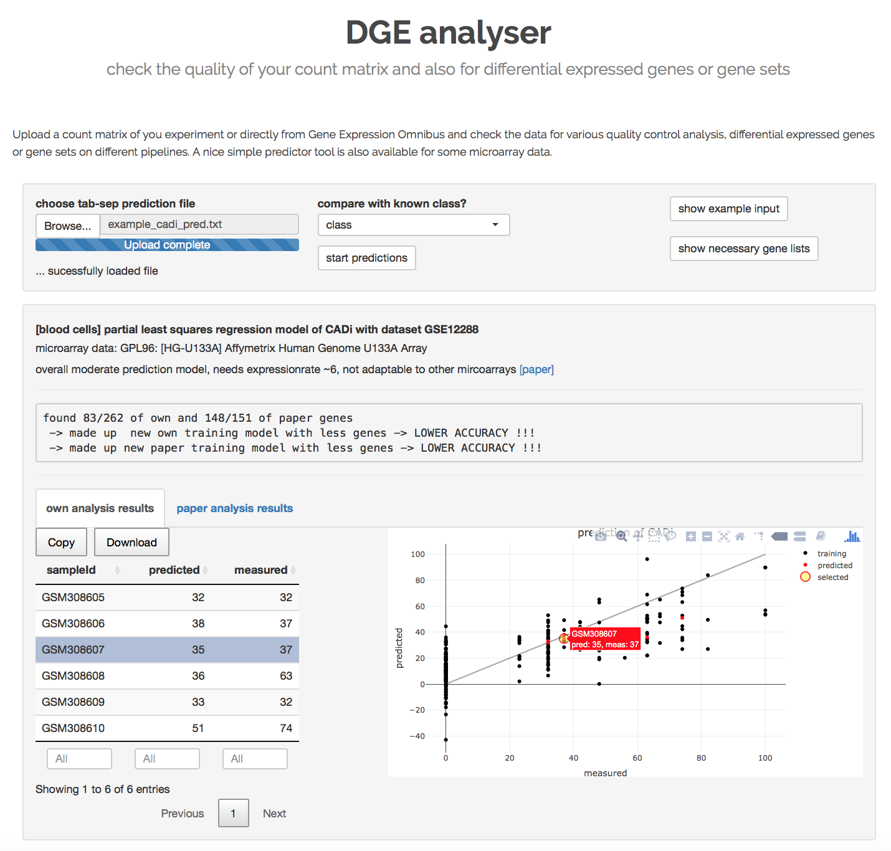
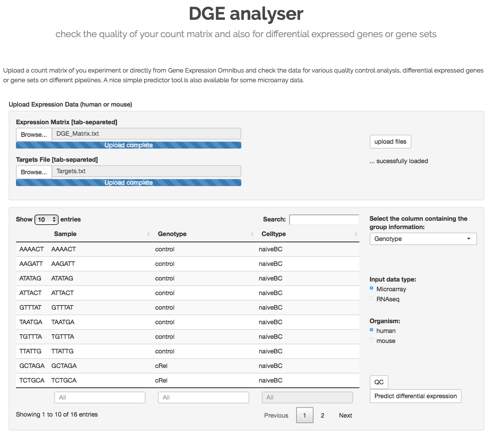
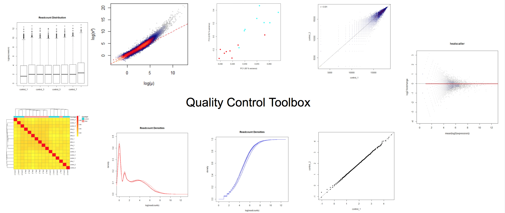
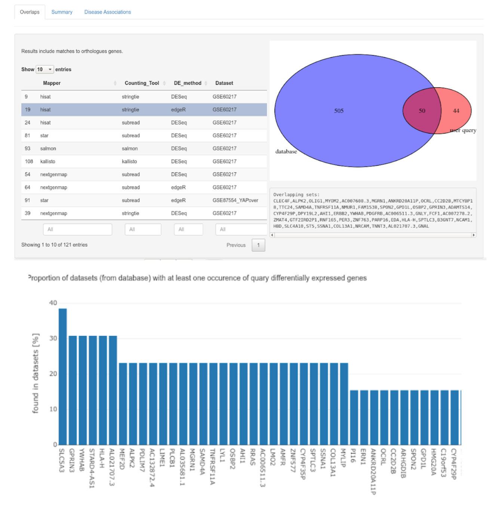
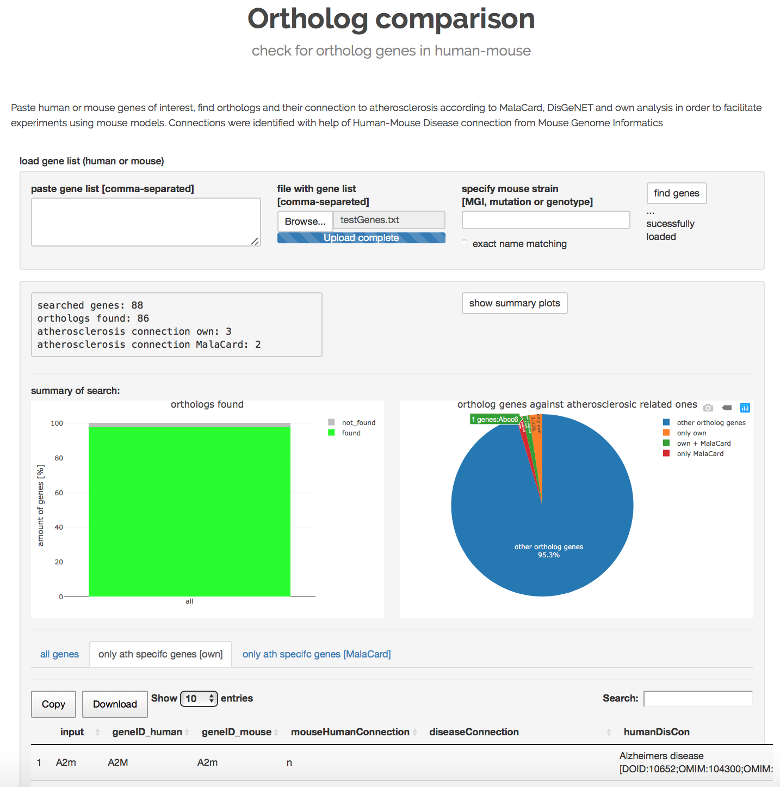
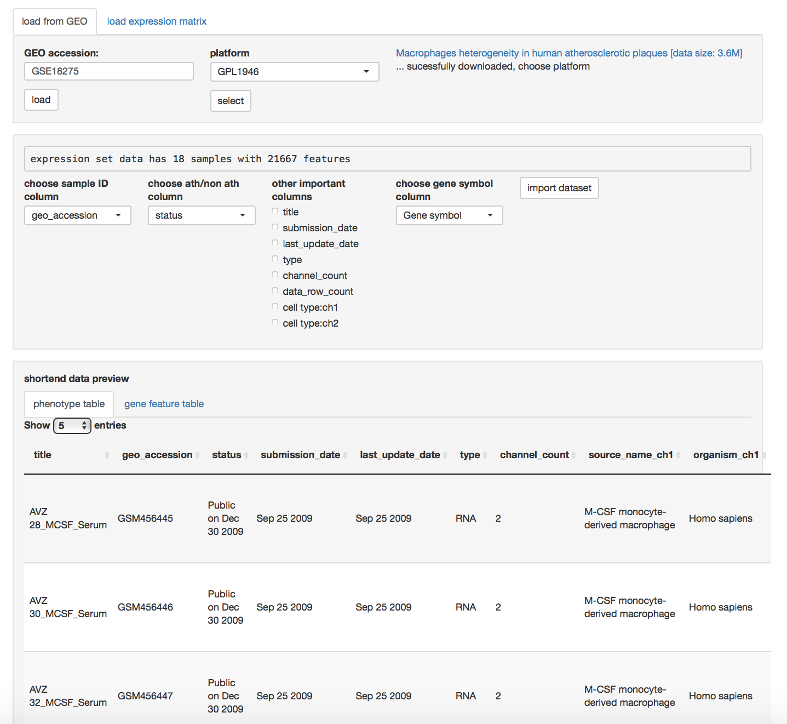

# Bacon
Basic Atherosclerosis Comparative Online Network  
[a group project of bioinformatics students at the TUM]

Bacon provides a platform to analyze differential gene expression of microarray or RNA-Seq datasets, execute a gene set enrichment analysis and gives the possibility to compare interesting results to an already implemented atherosclerosis database with 13 (with different pipelines over 120) datasets with regards to atherosclerosis. Through ortholog comparison, it is possible to perform cross-species comparisons within the database which helps to evaluate the connection between human and mouse.

## pipeline how a user can analyse his data with Bacon

13 different datasets were analysed using following various mappers:

---

## website with tools
[Rstudio server is necessary to host the apps]

---
### differential gene expression analysis tool

---
### gene set enrichment analysis against 13 implemented datasets

---
### ortholog comparison of mouse - human atherosclerosis genes

---
### the internal database can be extended by directly loading new datasets from GEO:

